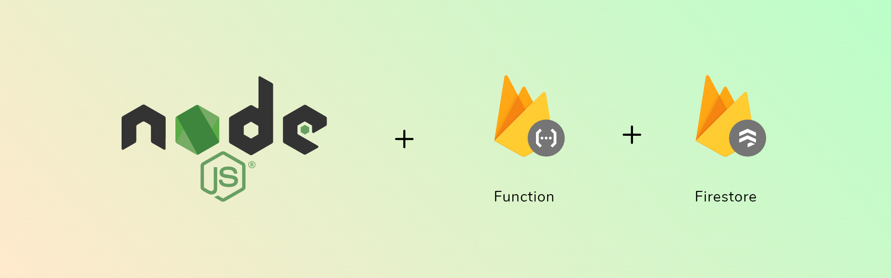
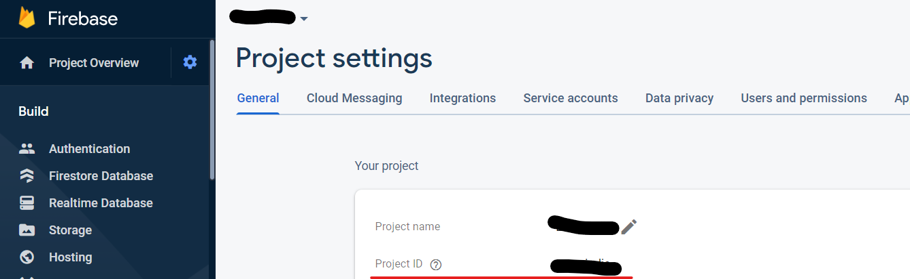
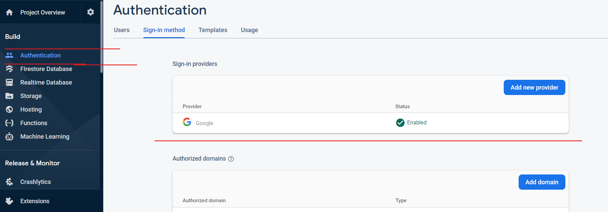
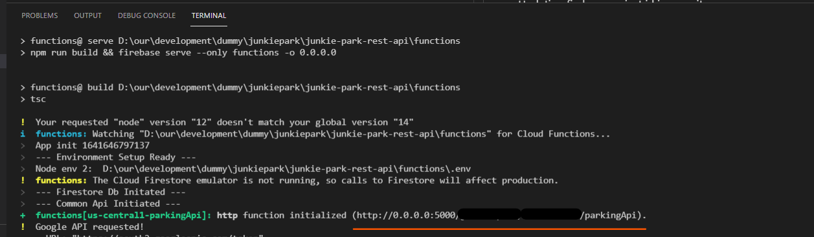

---




---

# Serverless REST API build with Cloud Functions, Firestore, Express and TypeScript

This is a simple API that manage billing of vehicles in parking area. 

> For related project, see [Junkie Parking App](https://github.com/JunkieLabs/junkie-parking-android-app) 


## Requirements

[NodeJS](https://nodejs.org/en/)

You will need a Firebase project and firebase tools cli

```
npm install -g firebase-tools
```

<br>

## Getting Started


### Clone this repository

```
git clone https://github.com/JunkieLabs/junkie-parking-rest-api.git .
```
<br>

### Create Firebase Project

- Log into [firebase](http://console.firebase.google.com/) and create a project.

> for more detail visit [Firebase Project setup](https://firebase.google.com/docs/android/setup)


- After creation of project, get the project id, this will be needed in next step.



<br>

- Enable google auth, this will be needed for authorizing [Junkie Parking App](https://github.com/JunkieLabs/junkie-parking-android-app).




<br>

- ***make sure your firebase project is in blaze.***

<br>

### Updating firebase project id in repository

- You need to change the firebase project name in *.firebaserc* file.

```
{
  "projects": {
    "default": "your-project-id"
  }
}
```

- After that, you can log in to firebase in the terminal 

```
firebase login
```

### install packages


- Go inside functions folder and install npm packages using terminal
```
npm install 
```


### Serve function

- Go inside the functions folder, and run serve command 

```
npm run serve
```

-  after this you will get a url which can be used in [Junkie Parking Android App](https://github.com/JunkieLabs/junkie-parking-android-app) project





## Deploy to firebase

- For the first time, you have deploy the hosting and functions together

```
npm run deploy
```


<br>

# Contributors:

- [Bharath Kishore](https://github.com/bhrthkshr)
- [Niraj Prakash](https://github.com/nirajprakash)

<br>

# FAQ:

### Is this project related to Junkie Parking Android App?


>  Yes! The App won't run without backend. You can this repo and run on your system.


<br>

# Further help

This project is an open-source initiative by Junkie Labs.

For any questions or suggestions send a mail to junkielabs.dev@gmail.com or chat with the core-team on gitter.

[](https://gitter.im/JunkieLabs/junkie-parking?utm_source=badge&utm_medium=badge&utm_campaign=pr-badge)

<br>
<br>

# License

[MIT License](/LICENSE).
